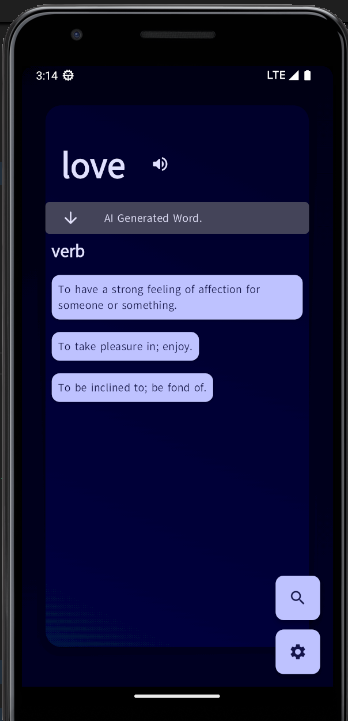
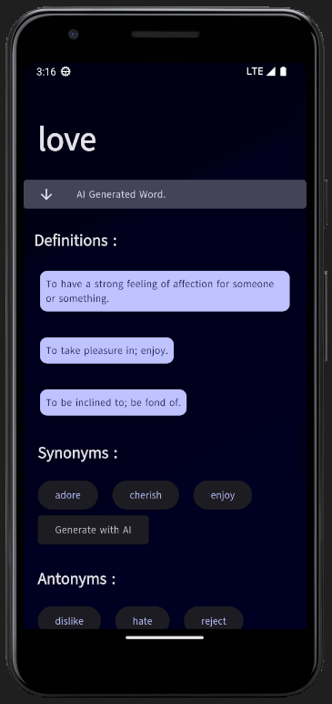
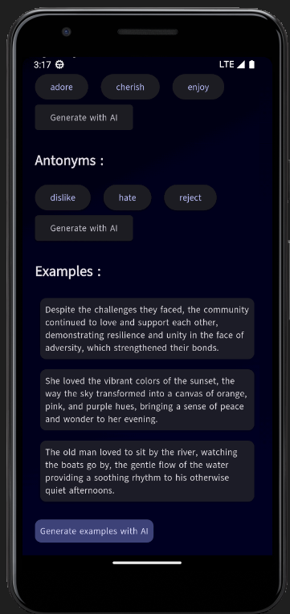
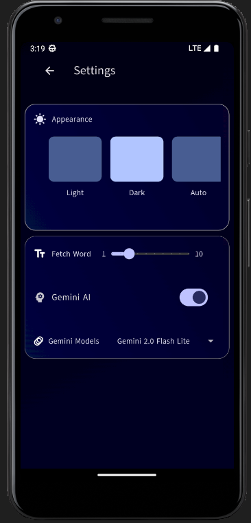
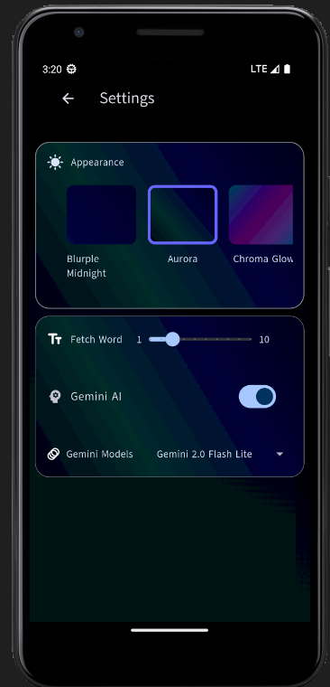
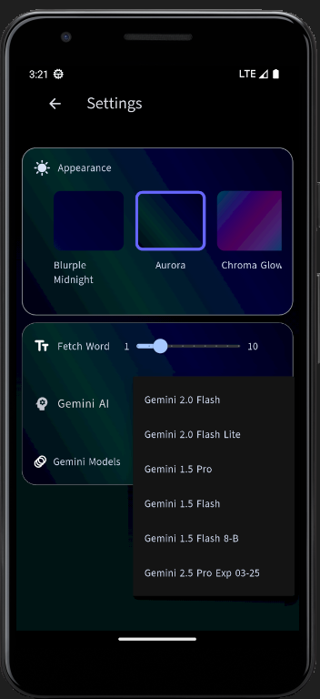

🧠 Vocabulary App
A sleek and interactive vocabulary builder built with Flutter and BLoC architecture. This app fetches rich word data from both a public Dictionary API and Gemini AI, offering definitions, examples, and more.

Swipe through a beautifully animated draggable slider to explore new words—each swipe refreshes the list with fresh vocabulary to help you expand your English skills effortlessly.

🚀 Features:
📖 Fetch words from Dictionary API + Gemini AI

🔄 Swipe to refresh and reveal new vocabulary

🎯 Built with clean architecture using BLoC for state management

📱 Flutter-powered for a smooth, cross-platform experience

Ideal for learners who want to build their vocabulary one swipe at a time.


checkout = `assets/ui` for app screenshots.


If you want to run this App and use Gemini AI.

consider using your own Api Key in "apiKey" field.
you can generate apikey from Google Ai Studio.

file = lib/features/gemini_ai/bloc/gemini_bloc.dart

```dart
final model = GenerativeModel(
      model : defaultModel.model,
      apiKey: apiKey, // use your own API KEY.

    );
```    










